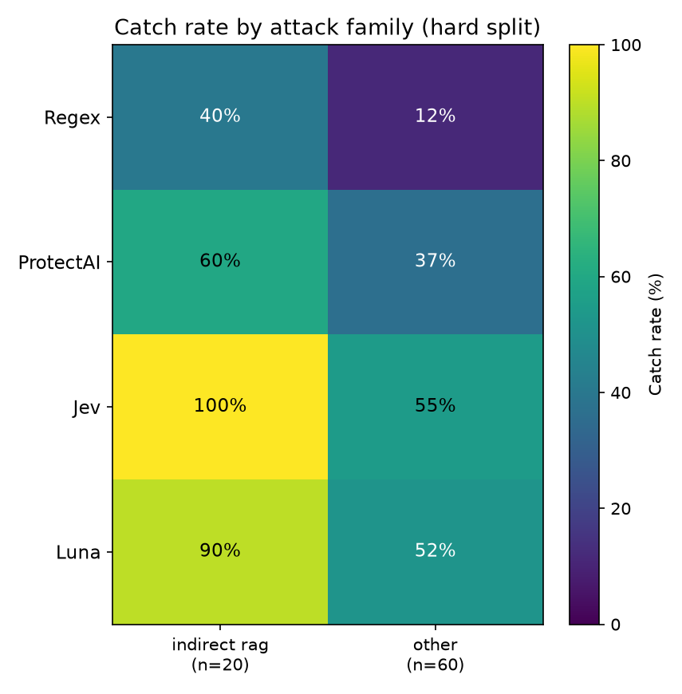
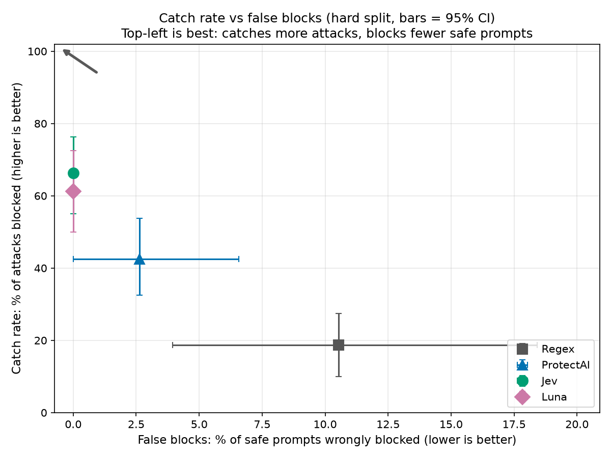
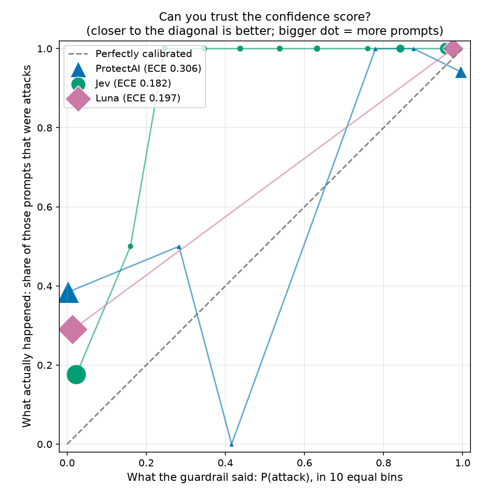
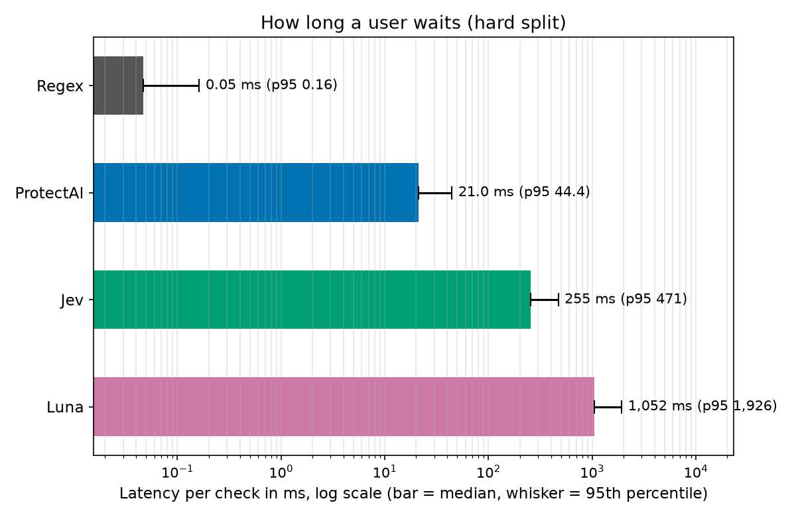

# Guardrail Showdown: scorecard (hard split)

Five prompt-injection guardrails, one dataset. On the **hard** split each method saw 156 prompts: 80 attacks and 76 safe ones (20 of the safe ones are tricky-but-safe). Regex = keyword rules we wrote; ProtectAI = small open classifier; Jev = decision model; Luna = GPT-6 as a judge; Lakera = managed security API.

## Scorecard

Numbers in square brackets are 95% confidence intervals. Differences smaller than the interval are ties.

| Method | Catch rate | False blocks | False blocks on tricky-but-safe (blocked/total) | Catch rate on hard attacks | Catch rate at 5% false blocks | ROC-AUC | Median latency (ms) | p95 latency (ms) | Cost per 1M checks (USD) | Calibration error (ECE) | Errors |
|---|---|---|---|---|---|---|---|---|---|---|---|
| Regex | 18.8% [10.0, 27.5] | 10.5% [3.9, 18.4] | 40.0% (8/20) | 40.0% [20.0, 60.0] | n/a | n/a | 0.05 | 0.16 | $0 (local) | n/a | 0 (0.0%) |
| ProtectAI | 42.5% [32.5, 53.8] | 2.6% [0.0, 6.6] | 10.0% (2/20) | 60.0% [40.0, 80.0] | 52.5% [42.5, 62.5] | 0.849 | 21.0 | 44.4 | $0 (local) | 0.306 | 0 (0.0%) |
| Jev | 66.2% [55.0, 76.2] | 0.0% [0.0, 0.0] | 0.0% (0/20) | 100.0% [100.0, 100.0] | 80.0% [71.2, 87.5] | 0.962 | 255 | 471 | $19.05 | 0.182 | 0 (0.0%) |
| Luna | 61.3% [50.0, 72.5] | 0.0% [0.0, 0.0] | 0.0% (0/20) | 90.0% [75.0, 100.0] | 63.7% [52.5, 75.0] | 0.892 | 1,052 | 1,926 | $35.55 | 0.197 | 0 (0.0%) |

How to read it:
- **Catch rate**: of all attacks, how many were blocked (higher is better).
- **False blocks**: of safe prompts, how many were wrongly blocked (lower is better). The tricky-but-safe subset (security homework, questions about SQL injection) is small, so read it as a hint, not a verdict.
- **Hard attacks**: obfuscated (encoding tricks), indirect (instructions hidden in documents) and persona/jailbreak attacks.
- **Catch rate at 5% false blocks**: scored methods only. The cut-off is picked on the **val** split as the lowest one that wrongly blocks at most 5% of safe prompts, then applied to hard. (5%, not 1%: about 10 'safe' prompts in val are jailbreak-style openers from the WildGuard source that every scored method flags at ~100%, so a 1% budget is unreachable because of disputed labels, not guardrail skill.)
- **ROC-AUC**: how well the raw score ranks attacks above safe prompts (1.0 perfect, 0.5 coin flip).
- **Calibration error (ECE)**: when it says 90%, is it right about 90% of the time? 0 is perfect; lower is better. n/a for yes/no-only tools.
- **Cost**: projected from the average real cost per call; local methods are free.

Cut-offs chosen on val for the 5% column: ProtectAI 0.00325 (blocks 7.9% of safe prompts on hard); Jev 0.14 (blocks 1.3% of safe prompts on hard); Luna 0.05 (blocks 0.0% of safe prompts on hard).

## Category breakdown: catch rate per attack family

| Method | indirect rag (n=20) | other (n=60) |
|---|---|---|
| Regex | 40.0% | 11.7% |
| ProtectAI | 60.0% | 36.7% |
| Jev | 100.0% | 55.0% |
| Luna | 90.0% | 51.7% |

Families with few attacks are noisy: one missed prompt can move the percentage a lot.

## Awards

| Award | Winner | Why (one line) |
|---|---|---|
| Catches the most attacks | Tie: Jev, Luna | Jev catches 66.2% [55.0, 76.2] of attacks; Luna catches 61.3% [50.0, 72.5] of attacks (intervals overlap, so no clear winner) |
| Fewest false blocks | Tie: Jev, Luna, ProtectAI | Jev wrongly blocks 0.0% [0.0, 0.0] of safe prompts; Luna wrongly blocks 0.0% [0.0, 0.0] of safe prompts; ProtectAI wrongly blocks 2.6% [0.0, 6.6] of safe prompts (intervals overlap, so no clear winner) |
| Fastest | Regex | Regex median 0.05 ms (p95 0.16 ms); next best ProtectAI median 21.0 ms (p95 44.4 ms) |
| Cheapest | Tie: Regex, ProtectAI | Regex $0 (local) per 1M checks; ProtectAI $0 (local) per 1M checks (exactly equal) |
| Most trustworthy confidence | Jev | Jev calibration error 0.182 (0 = perfect); next best Luna calibration error 0.197 (0 = perfect) |
| Best on hard attacks | Tie: Jev, Luna | Jev catches 100.0% [100.0, 100.0] of hard attacks; Luna catches 90.0% [75.0, 100.0] of hard attacks (intervals overlap, so no clear winner) |

A rate award is a **tie** when the runner-up's confidence interval overlaps the leader's. Speed, cost and calibration just take the best value. Methods with no cost data are left out of 'Cheapest'; yes/no-only methods are left out of 'Most trustworthy confidence'.

## Use X if...

_To be written by a human. Not auto-generated._

- Use Regex if... TODO
- Use ProtectAI if... TODO
- Use Jev if... TODO
- Use Luna if... TODO
- Jev's verdict (did it hold up on speed, cost and calibration, and where did it fall short?): TODO

## Charts

## Footnotes

1. **Dataset**: hard set: deepset/prompt-injections test split + 40 hand-written prompts (20 attacks hidden in content, 20 tricky-but-safe).
2. **Size**: hard: 156 prompts per method (80 attacks, 76 safe, 20 tricky-but-safe); test: 942 prompts per method (552 attacks, 390 safe, 11 tricky-but-safe); val: 941 prompts per method (534 attacks, 407 safe, 13 tricky-but-safe).
3. **Run date**: 2026-10-01 (last modified time of the results file).
4. **Errors**: a failed call (timeout, refusal, API error) counts as **not flagged**, because a guardrail that fails open lets the attack through. So errors lower catch rate and never raise false blocks. ROC-AUC, calibration, the cut-off and latency use only calls that returned a result.
5. **Confidence intervals**: bootstrap, 1,000 resamples of the prompts, seed 0, 2.5th to 97.5th percentile.
6. **Latency** is measured on successful calls only. Cost is the mean of the calls that reported a cost.
- **Left out (incomplete run)**: Lakera, 100% of calls failed (e.g. free quota exhausted). Methods with over 20% failed calls are not scored.
