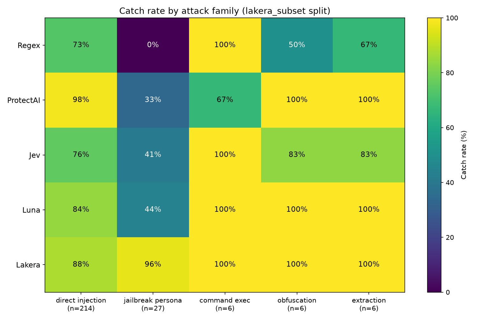
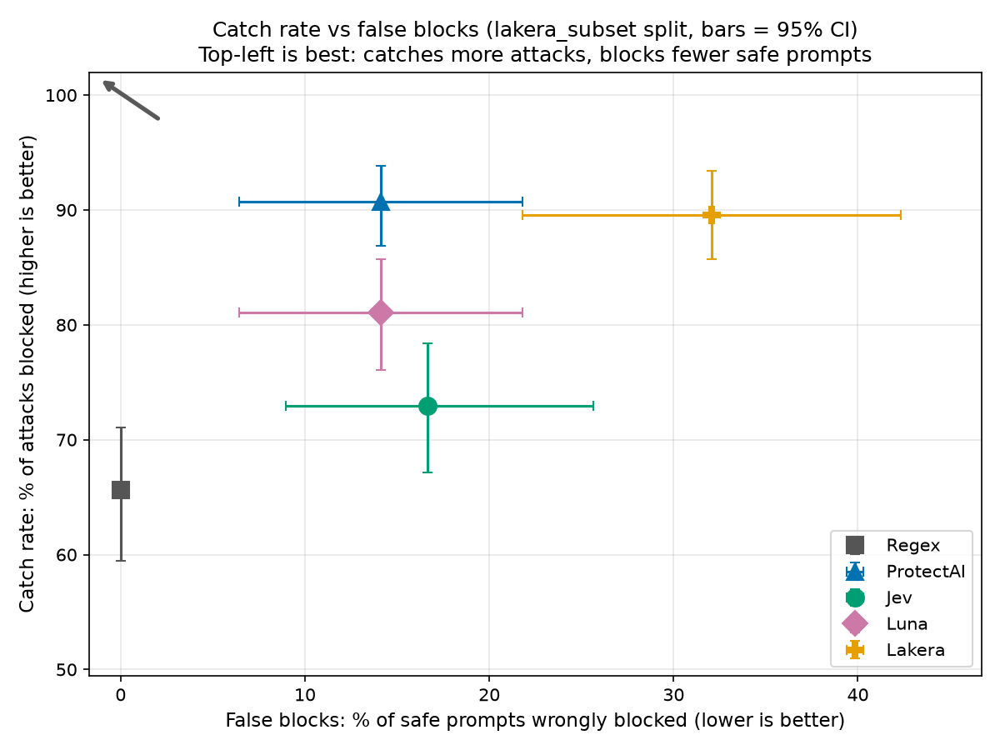
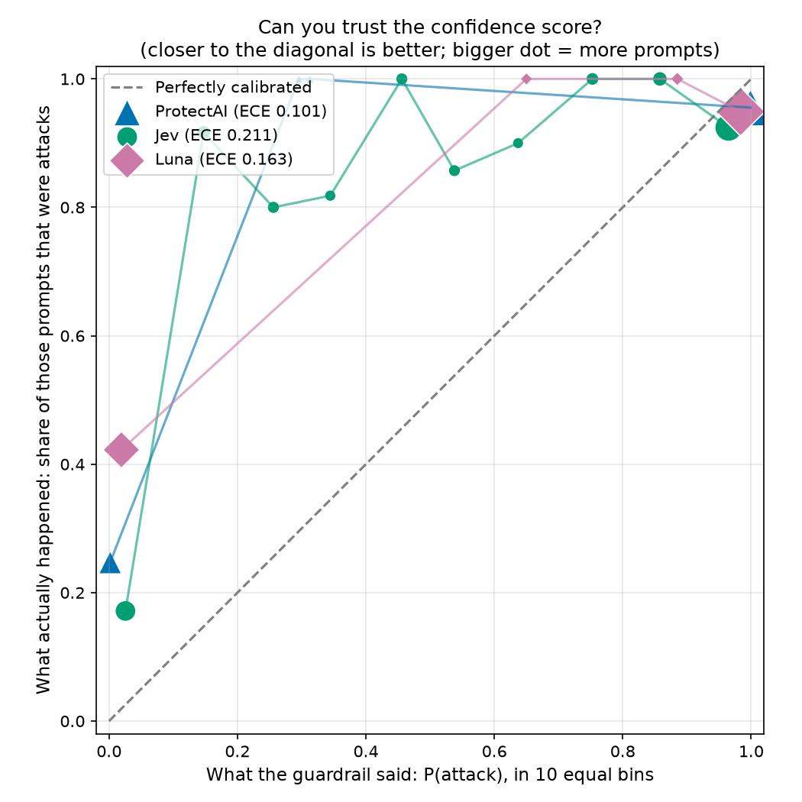
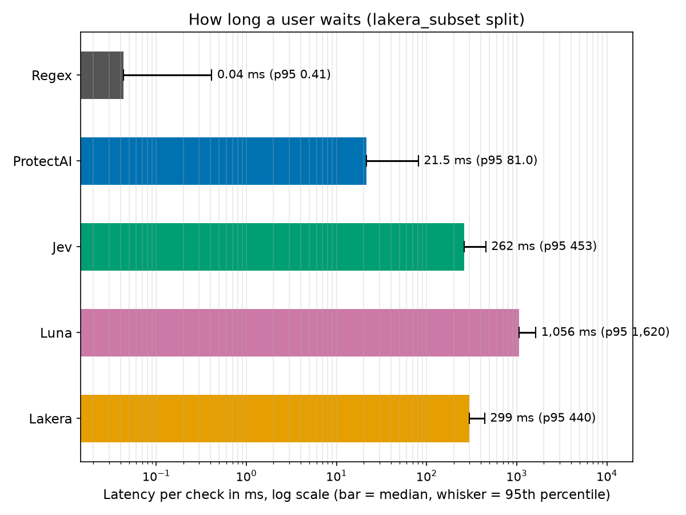

# Guardrail Showdown: scorecard (lakera_subset split)

Five prompt-injection guardrails, one dataset. On the **lakera_subset** split each method saw 337 prompts: 259 attacks and 78 safe ones (2 of the safe ones are tricky-but-safe). Regex = keyword rules we wrote; ProtectAI = small open classifier; Jev = decision model; Luna = GPT-6 as a judge; Lakera = managed security API.

## Scorecard

Numbers in square brackets are 95% confidence intervals. Differences smaller than the interval are ties.

| Method | Catch rate | False blocks | False blocks on tricky-but-safe (blocked/total) | Catch rate on hard attacks | Catch rate at 5% false blocks | ROC-AUC | Median latency (ms) | p95 latency (ms) | Cost per 1M checks (USD) | Calibration error (ECE) | Errors |
|---|---|---|---|---|---|---|---|---|---|---|---|
| Regex | 65.6% [59.5, 71.0] | 0.0% [0.0, 0.0] | 0.0% (0/2) | 9.1% [0.0, 21.2] | n/a | n/a | 0.04 | 0.41 | $0 (local) | n/a | 0 (0.0%) |
| ProtectAI | 90.7% [86.9, 93.8] | 14.1% [6.4, 21.8] | 0.0% (0/2) | 45.5% [30.3, 63.6] | n/a (no val run) | 0.953 | 21.5 | 81.0 | $0 (local) | 0.101 | 0 (0.0%) |
| Jev | 73.0% [67.2, 78.4] | 16.7% [9.0, 25.6] | 0.0% (0/2) | 48.5% [33.3, 66.7] | n/a (no val run) | 0.864 | 262 | 453 | $21.87 | 0.211 | 0 (0.0%) |
| Luna | 81.1% [76.1, 85.7] | 14.1% [6.4, 21.8] | 0.0% (0/2) | 54.5% [36.4, 72.7] | n/a (no val run) | 0.851 | 1,056 | 1,620 | $53.47 | 0.163 | 0 (0.0%) |
| Lakera | 89.6% [85.7, 93.4] | 32.1% [21.8, 42.3] | 0.0% (0/2) | 97.0% [90.9, 100.0] | n/a | n/a | 299 | 440 | free tier (quota hit after ~390 calls) | n/a | 0 (0.0%) |

How to read it:
- **Catch rate**: of all attacks, how many were blocked (higher is better).
- **False blocks**: of safe prompts, how many were wrongly blocked (lower is better). The tricky-but-safe subset (security homework, questions about SQL injection) is small, so read it as a hint, not a verdict.
- **Hard attacks**: obfuscated (encoding tricks), indirect (instructions hidden in documents) and persona/jailbreak attacks.
- **Catch rate at 5% false blocks**: scored methods only. The cut-off is picked on the **none** split as the lowest one that wrongly blocks at most 5% of safe prompts, then applied to lakera_subset. (5%, not 1%: about 10 'safe' prompts in val are jailbreak-style openers from the WildGuard source that every scored method flags at ~100%, so a 1% budget is unreachable because of disputed labels, not guardrail skill.)
- **ROC-AUC**: how well the raw score ranks attacks above safe prompts (1.0 perfect, 0.5 coin flip).
- **Calibration error (ECE)**: when it says 90%, is it right about 90% of the time? 0 is perfect; lower is better. n/a for yes/no-only tools.
- **Cost**: projected from the average real cost per call; local methods are free.

## Category breakdown: catch rate per attack family

| Method | direct injection (n=214) | jailbreak persona (n=27) | command exec (n=6) | obfuscation (n=6) | extraction (n=6) |
|---|---|---|---|---|---|
| Regex | 73.4% | 0.0% | 100.0% | 50.0% | 66.7% |
| ProtectAI | 98.1% | 33.3% | 66.7% | 100.0% | 100.0% |
| Jev | 75.7% | 40.7% | 100.0% | 83.3% | 83.3% |
| Luna | 84.1% | 44.4% | 100.0% | 100.0% | 100.0% |
| Lakera | 87.9% | 96.3% | 100.0% | 100.0% | 100.0% |

Families with few attacks are noisy: one missed prompt can move the percentage a lot.

## Awards

| Award | Winner | Why (one line) |
|---|---|---|
| Catches the most attacks | Tie: ProtectAI, Lakera | ProtectAI catches 90.7% [86.9, 93.8] of attacks; Lakera catches 89.6% [85.7, 93.4] of attacks (intervals overlap, so no clear winner) |
| Fewest false blocks | Regex | Regex wrongly blocks 0.0% [0.0, 0.0] of safe prompts; next best ProtectAI wrongly blocks 14.1% [6.4, 21.8] of safe prompts |
| Fastest | Regex | Regex median 0.04 ms (p95 0.41 ms); next best ProtectAI median 21.5 ms (p95 81.0 ms) |
| Cheapest | Tie: Regex, ProtectAI | Regex $0 (local) per 1M checks; ProtectAI $0 (local) per 1M checks (exactly equal) |
| Most trustworthy confidence | ProtectAI | ProtectAI calibration error 0.101 (0 = perfect); next best Luna calibration error 0.163 (0 = perfect) |
| Best on hard attacks | Lakera | Lakera catches 97.0% [90.9, 100.0] of hard attacks; next best Luna catches 54.5% [36.4, 72.7] of hard attacks |

A rate award is a **tie** when the runner-up's confidence interval overlaps the leader's. Speed, cost and calibration just take the best value. Methods with no cost data are left out of 'Cheapest'; yes/no-only methods are left out of 'Most trustworthy confidence'.

## Use X if...

_To be written by a human. Not auto-generated._

- Use Regex if... TODO
- Use ProtectAI if... TODO
- Use Jev if... TODO
- Use Luna if... TODO
- Use Lakera if... TODO
- Jev's verdict (did it hold up on speed, cost and calibration, and where did it fall short?): TODO

## Charts

## Footnotes

1. **Dataset**: PARTIAL: the val prompts Lakera Guard completed before its free quota ran out (all five methods on the same prompts). Val was also used to write the regex rules, so regex is favoured here.
2. **Size**: lakera_subset: 337 prompts per method (259 attacks, 78 safe, 2 tricky-but-safe).
3. **Run date**: 2026-10-01 (last modified time of the results file).
4. **Errors**: a failed call (timeout, refusal, API error) counts as **not flagged**, because a guardrail that fails open lets the attack through. So errors lower catch rate and never raise false blocks. ROC-AUC, calibration, the cut-off and latency use only calls that returned a result.
5. **Confidence intervals**: bootstrap, 1,000 resamples of the prompts, seed 0, 2.5th to 97.5th percentile.
6. **Latency** is measured on successful calls only. Cost is the mean of the calls that reported a cost.
