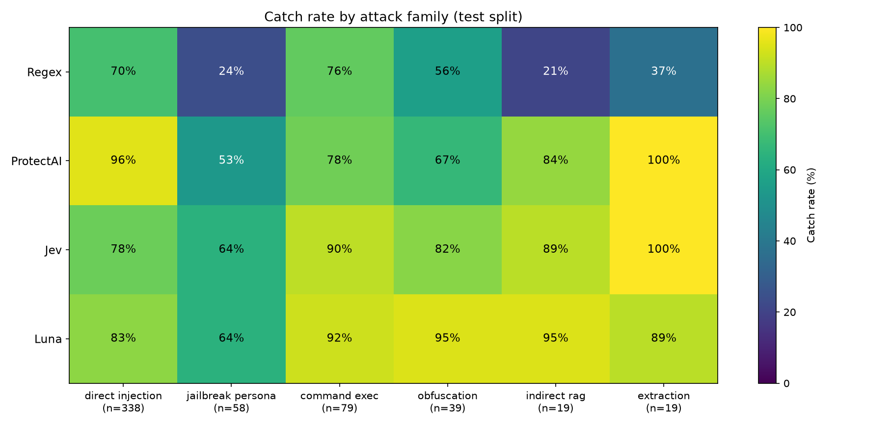
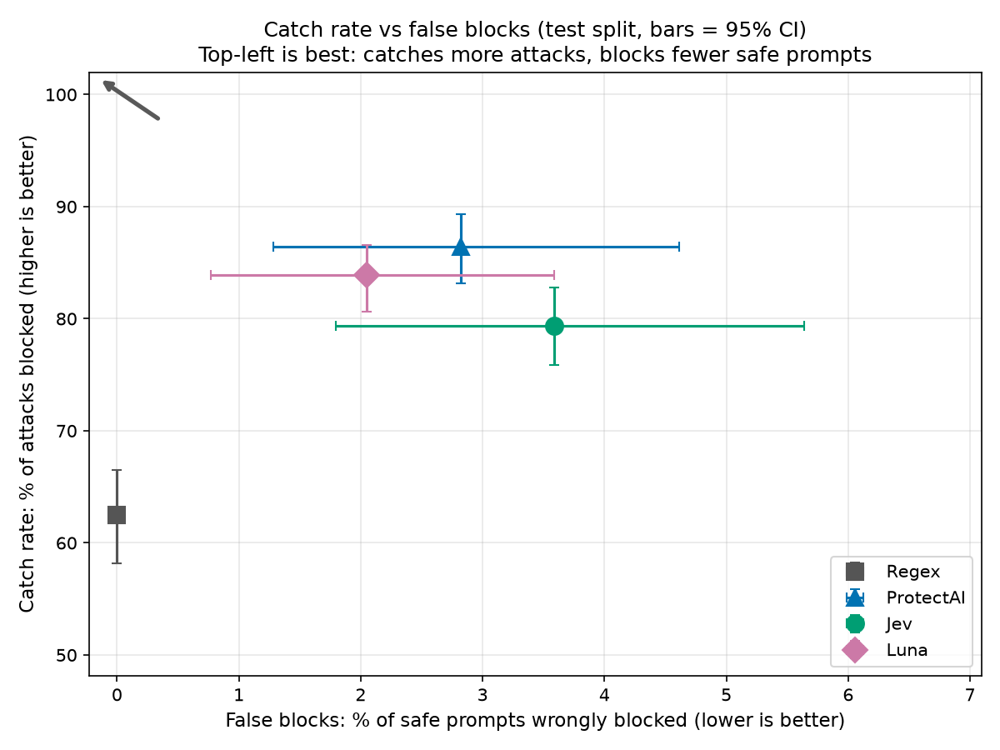
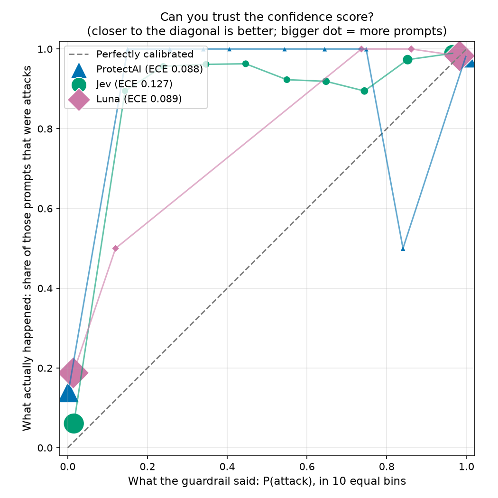
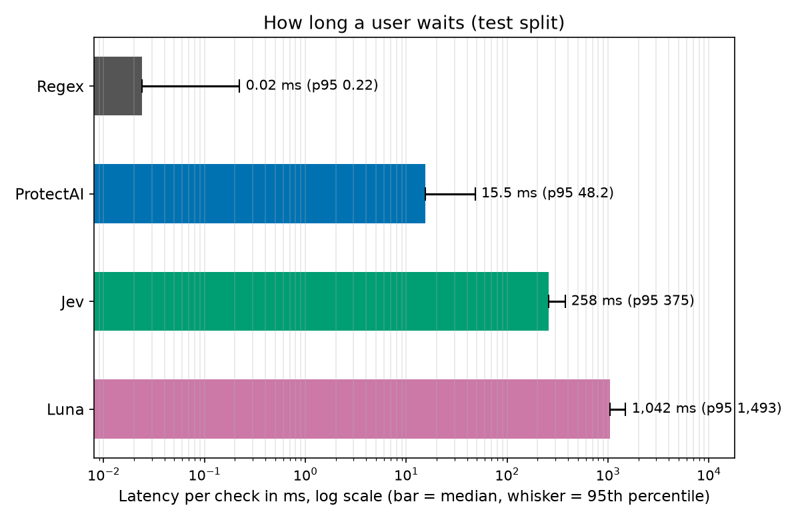

# Guardrail Showdown: scorecard (test split)

Five prompt-injection guardrails, one dataset. On the **test** split each method saw 942 prompts: 552 attacks and 390 safe ones (11 of the safe ones are tricky-but-safe). Regex = keyword rules we wrote; ProtectAI = small open classifier; Jev = decision model; Luna = GPT-6 as a judge; Lakera = managed security API.

## Scorecard

Numbers in square brackets are 95% confidence intervals. Differences smaller than the interval are ties.

| Method | Catch rate | False blocks | False blocks on tricky-but-safe (blocked/total) | Catch rate on hard attacks | Catch rate at 5% false blocks | ROC-AUC | Median latency (ms) | p95 latency (ms) | Cost per 1M checks (USD) | Calibration error (ECE) | Errors |
|---|---|---|---|---|---|---|---|---|---|---|---|
| Regex | 62.5% [58.2, 66.5] | 0.0% [0.0, 0.0] | 0.0% (0/11) | 34.5% [25.9, 43.1] | n/a | n/a | 0.02 | 0.22 | $0 (local) | n/a | 0 (0.0%) |
| ProtectAI | 86.4% [83.2, 89.3] | 2.8% [1.3, 4.6] | 18.2% (2/11) | 62.9% [54.3, 71.6] | 92.4% [90.0, 94.4] | 0.976 | 15.5 | 48.2 | $0 (local) | 0.088 | 0 (0.0%) |
| Jev | 79.3% [75.9, 82.8] | 3.6% [1.8, 5.6] | 9.1% (1/11) | 74.1% [66.4, 81.9] | 94.6% [92.6, 96.2] | 0.977 | 258 | 375 | $20.21 | 0.127 | 0 (0.0%) |
| Luna | 83.9% [80.6, 86.6] | 2.1% [0.8, 3.6] | 0.0% (0/11) | 79.3% [71.6, 86.2] | 86.6% [83.5, 89.3] | 0.956 | 1,042 | 1,493 | $44.07 | 0.089 | 0 (0.0%) |

How to read it:
- **Catch rate**: of all attacks, how many were blocked (higher is better).
- **False blocks**: of safe prompts, how many were wrongly blocked (lower is better). The tricky-but-safe subset (security homework, questions about SQL injection) is small, so read it as a hint, not a verdict.
- **Hard attacks**: obfuscated (encoding tricks), indirect (instructions hidden in documents) and persona/jailbreak attacks.
- **Catch rate at 5% false blocks**: scored methods only. The cut-off is picked on the **val** split as the lowest one that wrongly blocks at most 5% of safe prompts, then applied to test. (5%, not 1%: about 10 'safe' prompts in val are jailbreak-style openers from the WildGuard source that every scored method flags at ~100%, so a 1% budget is unreachable because of disputed labels, not guardrail skill.)
- **ROC-AUC**: how well the raw score ranks attacks above safe prompts (1.0 perfect, 0.5 coin flip).
- **Calibration error (ECE)**: when it says 90%, is it right about 90% of the time? 0 is perfect; lower is better. n/a for yes/no-only tools.
- **Cost**: projected from the average real cost per call; local methods are free.

Cut-offs chosen on val for the 5% column: ProtectAI 0.00325 (blocks 4.4% of safe prompts on test); Jev 0.14 (blocks 4.4% of safe prompts on test); Luna 0.05 (blocks 2.6% of safe prompts on test).

## Category breakdown: catch rate per attack family

| Method | direct injection (n=338) | jailbreak persona (n=58) | command exec (n=79) | obfuscation (n=39) | indirect rag (n=19) | extraction (n=19) |
|---|---|---|---|---|---|---|
| Regex | 70.4% | 24.1% | 75.9% | 56.4% | 21.1% | 36.8% |
| ProtectAI | 95.6% | 53.4% | 78.5% | 66.7% | 84.2% | 100.0% |
| Jev | 77.5% | 63.8% | 89.9% | 82.1% | 89.5% | 100.0% |
| Luna | 83.1% | 63.8% | 92.4% | 94.9% | 94.7% | 89.5% |

Families with few attacks are noisy: one missed prompt can move the percentage a lot.

## Awards

| Award | Winner | Why (one line) |
|---|---|---|
| Catches the most attacks | Tie: ProtectAI, Luna | ProtectAI catches 86.4% [83.2, 89.3] of attacks; Luna catches 83.9% [80.6, 86.6] of attacks (intervals overlap, so no clear winner) |
| Fewest false blocks | Regex | Regex wrongly blocks 0.0% [0.0, 0.0] of safe prompts; next best Luna wrongly blocks 2.1% [0.8, 3.6] of safe prompts |
| Fastest | Regex | Regex median 0.02 ms (p95 0.22 ms); next best ProtectAI median 15.5 ms (p95 48.2 ms) |
| Cheapest | Tie: Regex, ProtectAI | Regex $0 (local) per 1M checks; ProtectAI $0 (local) per 1M checks (exactly equal) |
| Most trustworthy confidence | ProtectAI | ProtectAI calibration error 0.088 (0 = perfect); next best Luna calibration error 0.089 (0 = perfect) |
| Best on hard attacks | Tie: Luna, Jev, ProtectAI | Luna catches 79.3% [71.6, 86.2] of hard attacks; Jev catches 74.1% [66.4, 81.9] of hard attacks; ProtectAI catches 62.9% [54.3, 71.6] of hard attacks (intervals overlap, so no clear winner) |

A rate award is a **tie** when the runner-up's confidence interval overlaps the leader's. Speed, cost and calibration just take the best value. Methods with no cost data are left out of 'Cheapest'; yes/no-only methods are left out of 'Most trustworthy confidence'.

## Use X if...

_To be written by a human. Not auto-generated._

- Use Regex if... TODO
- Use ProtectAI if... TODO
- Use Jev if... TODO
- Use Luna if... TODO
- Jev's verdict (did it hold up on speed, cost and calibration, and where did it fall short?): TODO

## Charts

## Footnotes

1. **Dataset**: neuralchemy/Prompt-injection-dataset, 'core' config, test split.
2. **Size**: hard: 156 prompts per method (80 attacks, 76 safe, 20 tricky-but-safe); test: 942 prompts per method (552 attacks, 390 safe, 11 tricky-but-safe); val: 941 prompts per method (534 attacks, 407 safe, 13 tricky-but-safe).
3. **Run date**: 2026-10-01 (last modified time of the results file).
4. **Errors**: a failed call (timeout, refusal, API error) counts as **not flagged**, because a guardrail that fails open lets the attack through. So errors lower catch rate and never raise false blocks. ROC-AUC, calibration, the cut-off and latency use only calls that returned a result.
5. **Confidence intervals**: bootstrap, 1,000 resamples of the prompts, seed 0, 2.5th to 97.5th percentile.
6. **Latency** is measured on successful calls only. Cost is the mean of the calls that reported a cost.
- **Left out (incomplete run)**: Lakera, 99% of calls failed (e.g. free quota exhausted). Methods with over 20% failed calls are not scored.
